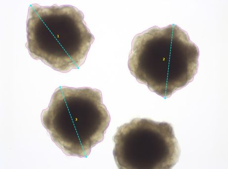

# Organoid analysis (Shi Lab)

The goal of this project is to measure properties of neuronal organoids, imaged using a brightfield dissecting microscope. The organoids in these images appear as dark circular objects against a bright (white) background.

## Usage

### Setup and installation

#### Using uv (Recommended)

This project uses [uv](https://docs.astral.sh/uv/) to manage virtual environments and dependencies. 

1. Install ``uv``
    * **macOS or Linux:** ``curl -LsSf https://astral.sh/uv/install.sh | sh``
    * **Windows:** ``powershell -ExecutionPolicy ByPass -c "irm https://astral.sh/uv/install.ps1 | iex"``
    
    To check if you have ``uv`` installed, open a terminal and run ``uv --version``.

2. Clone the repository
   ```bash
   git clone git@github.com:vaioic/shi-lab-organoid-analysis.git
   cd shi-lab-organoid-analysis
   ```

3. Sync the environment (this will setup the correct virtual environment and dependencies)
   ```bash
   uv sync
   ```

4. Run the appropriate analysis script, for example
   ```bash
   uv run analysis/20260702_Run02_OIC334.py
   ```

#### Using venv and pip

1. Clone the repository
   ```bash
   git clone git@github.com:vaioic/shi-lab-organoid-analysis.git
   cd shi-lab-organoid-analysis
   ```

2. Create a virtual environment
   ```bash
   python -m venv venv
   ```

3. Activate the environment
   ```bash
   # macOS/Linux
   source ./venv/bin/activate

   # Windows (PowerShell)
   .\venv\Scripts\Activate.ps1
   ```

4. Install the repository as an editable module
   ```bash
   python -m pip install -e .
   ```

5. Run the analysis script
   ```bash
   python -m analysis.analysis_script

   # or
   python analysis/analysis_script.py
   ```

### Inputs

The processing function expects data to be in the following data structure: Day >
Genotype > image file (e.g., D7/sp7/0014.tif).

More details can be found in the in-code documentation.

### Outputs

For each image file, the code will generate:

* a CSV file with measured data
* a PNG image showing segmentation outline, cell ID, and the points used in the feret
  diameter measurement

Additionally, for each folder, the code will generate a ``merged.csv`` file which
combines all the data from the individual images.

The data measured from each organoid are:
* Area in pixels
* Area in &mu;m&sup2;
* Feret diameter (i.e., the largest diameter measurable) in pixels
* Feret diameter in &mu;m&sup2
* Eccentricity (0 = perfect circle, 1 = straight line)

<figure>
  
  <figcaption align="center"><i>Example output showing segmentation outlines</i></figcaption>
</figure>

## Issues

If you encounter any issues with running the code or have any questions, please create an [Issue](https://github.com/vaioic/shi-lab-organoid-analysis/issues) or send an email to opticalimaging@vai.org. If you are reporting a programmatic bug, please include any error messages to aid with troubleshooting.

## License

This project is licensed under the GPLv3 License. See the [LICENSE](LICENSE) file for details.

## Citing & Acknowledgements

This repository is publicly available for open-source use, but it is developed and maintained by the Optical Imaging Core at the Van Andel Institute. If code from this repository contributed to data used in a publication, abstract, or presentation, please cite and acknowledge our work based on your affiliation:

### For External Users
Please cite this repository and acknowledge the author(s) in your publication's materials, methods, or acknowledgements section:
> "Image analysis pipelines were adapted from open-source tools developed by the Optical Imaging Core at the Van Andel Institute (GitHub:[shi-lab-organoid-analysis](https://github.com/vaioic/shi-lab-organoid-analysis))."

If you require custom adjustments or advanced analysis support, please contact us at opticalimaging@vai.org.

### For Internal Users & Close Collaborators
If you are an internal researcher or an external collaborator working directly with our staff, please include our Research Resource Identifier (RRID) in your materials and methods section:
> "Image analysis and data processing were performed in collaboration with the Optical Imaging Core at the Van Andel Institute (RRID:SCR_021968)."

Please review the Acknowledgement and Authorship Guidelines on [VAI's Core Technology and Services website](https://vanandelinstitute.sharepoint.com/sites/Cores/SitePages/Acknowledgements-and-Authorship.aspx)

### Contributors
<a href="https://github.com/vaioic/shi-lab-organoid-analysis/graphs/contributors">
  
</a>

## Changelog

### v0.1.0 (2026-06-30)
* Initial commit with preliminary code ([OIC-304](https://varioic.atlassian.net/browse/OIC-304))